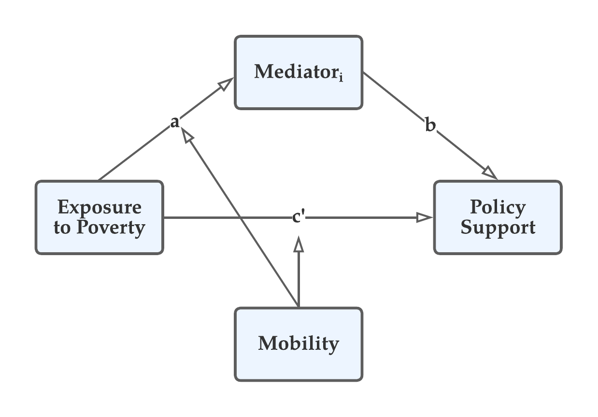

---
header-includes:
- \usepackage{dcolumn}
output: 
  bookdown::pdf_document2:
    number_sections: true
    theme: cosmo
    highlight: tango
    toc: false
    toc_depth: 3
    includes:
        #- ../format_files/abstract.Rmd
        #- ../format_files/acknowledgements.Rmd
      in_header: tex_styles.sty
      before_body:
        - ../format_files/front_matter.Rmd       
        - ../format_files/table_of_contents.Rmd
        - ../format_files/list_of_figures.Rmd
        - ../format_files/list_of_tables.Rmd
geometry: "left=2cm, right=2cm, top=1.25cm, bottom=1.75cm"  
editor_options: 
  chunk_output_type: console
---

\newpage

\pagenumbering{arabic}

```{r setup, include=FALSE, eval=T}
quick_compile = F
if(quick_compile){ 
    n_boot = 5
    message("Quick compile with ",n_boot, "bootstraps")
  } else {
    n_boot = 2000
    message("Full compile with ",n_boot, "bootstraps")
}
options(knitr.kable.NA = '-')
knitr::opts_chunk$set(echo = F, out.width = "83%", fig.pos = 'H', fig.align = "center")
options(scipen=999, dplyr.summarise.inform = FALSE)
library(dplyr)
library(stargazer)
library(ggplot2)
library(ggtext)
library(stringr)
library(ggpubr)
library(readr)
library(kableExtra)
library(broom)
library(lubridate)
library(psych)

fpath <- "2022_08_02_Empathy_Poor_Homelessness_Videos_Pilot - David Broska - based on 2021_09_16_Empathy_Poor_November 9, 2022_19.53.csv"
if(!str_detect(getwd(),"written")){
  fpath <- paste0("written/2_report_on_4/",fpath)
}


theme_set(theme_bw())
col_names <- names(read_csv(fpath,n_max =  0, show_col_types = F))
question_text <- as.character(read_csv(fpath, show_col_types = F)[1,])
# drop first two lines that describe the data in the columns
df_raw123 <- read_csv(fpath, col_names = col_names, skip = 3, show_col_types = F) %>% 
  filter(Status != "Survey Preview", Finished == T) %>% 
  mutate(start_ymd = as.Date(StartDate), 
         dv_gen_welfare_2rec = 100 - dv_gen_welfare_2,     # reverse coded
         empa_conc_1rec = 100 - empa_conc_1, 
         empa_conc_3rec = 100 - empa_conc_3,
         me_persp_tak_2rec = 100 - me_persp_tak_2,
         dem_edu_coll = case_when(dem_edu %in% c("4: Bachelor's degree","3: Some college or Associate's degree") ~ "Some college degree", 
                             dem_edu == "5: Postgraduate (Master's degree, Ph.D., Professional degree)" ~ "Postgraduate", 
                             dem_edu %in% c("2: High school diploma / GED","1: Less than high school") ~ "High school diploma or less") %>% factor(levels = c("High school diploma or less", "4: Bachelor's degree","3: Some college or Associate's degree", "Some college degree", "Postgraduate")),
         pilot_number = case_when(start_ymd==as.Date("2022-10-06") ~ "1_n15",
                                  start_ymd==as.Date("2022-10-12") ~ "2_n15", 
                                  start_ymd %in% as.Date(c("2022-10-13", "2022-10-14"))~"3_n200", 
                                  start_ymd %in% as.Date(c("2022-11-08","2022-11-09")) ~"4_n300"), 
         gender = ifelse(gender=="Click to write Choice 3", NA, gender), 
         race = str_remove(race, "[0-9]: "))

# compute mean of income brackets (max in case of the lowest, and min in case of the highest)
df_raw123$income_num <- str_remove(df_raw123$income, "[0-9]+: (Less than )?[$]") %>% str_remove_all(",") %>% str_remove_all("[+ ]")

m <- vector(mode="numeric")
for (i in 1:length(df_raw123$income_num)){
  s <- df_raw123$income_num[i]
  if(!is.na(s) & str_detect(s,"-")){
    ss <- unlist(str_split(s, "-"))
    m[i] <- mean(as.numeric(ss))
  } else {
    m[i] <- as.numeric(s)
  }
}
df_raw123$income_num <- m


composite_mes <- c("Empathy", "PerspTak", "DisAttr", "SitAttr", "TrustGov")
composite_dvs <- c("GenWelfSupp", "Welf4Poor", "Welf4HardWork", 
                   "SpecWelf4Mob", "SpecWelf4Poor","AllWelfComp","IneqMagnPercep")

```

```{r get-qtext-function}
get_qtext <- function(pattern){
  tibble(variable = col_names, question_text) %>% 
    mutate(question_text=str_remove(question_text, "[a-zA-Z ]+[: …...]+ -") %>% 
             str_replace_all("[“”]", "") %>% str_replace_all("−","-")) %>% 
    filter(variable == pattern) %>% 
    pull(question_text)
}
```


```{r plot-dv-function}
plot_dv <- function(dependent_var, ylab="Agreement", xlab="Empathy Condition", subtitle=NA){
  
  d <- df[,c(dependent_var, "mobility_condition", "empathy_condition")]
  colnames(d)[1] <- "y"
  
  # note if some variables are only partially available
  # only collected for some studies
  if(any(is.na(d$y))){
    n = sum(!is.na(d$y))
    note = paste0("Plot based on ",n," out of n=",nrow(d)," observations.")
    d = filter(d, !is.na(d$y))
  } else {
    note = paste0("Plot based on n=",nrow(d)," observations.")
  }
  

  summ <- d %>% 
    group_by(empathy_condition, mobility_condition) %>%
    summarise(mean.value = mean(y),
              sd.value = sd(y), count = n(),
              se.mean = sd.value/sqrt(count)) %>% 
    ungroup()
  
  summ_m <- d %>% 
    group_by(mobility_condition) %>% 
    summarise(mean = mean(y),
              sd = sd(y), count = n(),
              se.mean = sd/sqrt(count)) %>% 
    ungroup()
  
  # high vs low mobility
  mhigh <- df[df$mobility_condition=="high",]
  mlow  <- df[df$mobility_condition=="low",]
  
  avg_mhigh <- filter(summ_m,mobility_condition=="high") %>% pull(mean) %>% round(2)
  se_mhigh <-  filter(summ_m,mobility_condition=="high") %>% pull(se.mean) %>% round(2)
  
  avg_mlow <- filter(summ_m,mobility_condition=="low") %>% pull(mean) %>% round(2)
  se_mlow <-  filter(summ_m,mobility_condition=="low") %>% pull(se.mean) %>% round(2)
  
  
  highm_string <- paste0("High mobility\n(m=",avg_mhigh,", se=",se_mhigh,")")
  lowm_string <- paste0("Low mobility\n(m=",avg_mlow,", se=",se_mlow,")")
  
  dd <- left_join(d,summ,by=c("empathy_condition","mobility_condition")) %>%
    mutate(mobility_condition=factor(mobility_condition, levels = c("low","high"),
                                    labels = c(lowm_string, highm_string)))
  
  # https://github.com/tidyverse/ggplot2/wiki/labeller "#EBCC2A" yellow
  ggplot(dd, aes(empathy_condition, y)) + 
    geom_jitter(size = 0.25, width = .1, alpha=0.4) + 
    stat_summary(fun=mean, geom="point",color="darkred", shape ="square", size = 1.5) +
    geom_errorbar(aes(ymin=mean.value-se.mean,ymax=mean.value+se.mean), width=.075, color = "darkred") +
    facet_wrap(~ mobility_condition) +
    labs(subtitle = ifelse(is.na(subtitle), get_qtext(dependent_var), subtitle),
         x =xlab, y = ylab, caption = note, color = "Party") + 
    theme(plot.subtitle = element_textbox_simple()) + 
    theme(text = element_text(size = 8))  + 
    geom_text(aes(x=empathy_condition,y=-4.4, 
                  label=paste0("m=",round(mean.value,2),"\nse=",round(se.mean,2))), size=2, fontface="plain") 
  
}
se_caption <- paste0("Note: The plot shows the means in the four groups and the associated standard error of the mean.")
```

\newpage 

# Data collection 

```{r attention-and-other-sanity-checks}
# exclude first pilot because of different video lengths
df_raw <- df_raw123 %>% filter(pilot_number %in% c("2_n15","3_n200", 
                                                   "4_n300"))

# mobility manipulation check
df_raw <- df_raw %>% 
  mutate(mob_manip_correct = case_when(
    mobility_condition=="high"& mob_manip_check=="There are good opportunities to advance through hard-work"~1,
    mobility_condition=="low"&mob_manip_check=="Opportunities to advance through hard-work are very limited"~1)) %>% 
  mutate(mob_manip_correct = ifelse(is.na(mob_manip_correct), 0, 1), 
         # attention check failed if they did not fill it out or if they did not select Cashier
         att_check_passed = if_else(!is.na(attention_check) & attention_check == "Cashier", 1, 0)) %>% 
  mutate(past_inc_lvl = str_extract(past_income,"[0-9]") %>% as.numeric(), 
         curr_inc_lvl = str_extract(current_income,"[0-9]") %>%as.numeric(), 
         mobility = case_when(past_inc_lvl == curr_inc_lvl ~ "steady", 
                              past_inc_lvl > curr_inc_lvl ~ "down", 
                              past_inc_lvl < curr_inc_lvl ~ "upward"))


# attention check
check_att <- sum(df_raw$att_check_passed)
check_att_perc <- round(100 * check_att / nrow(df_raw), 2)
# mobility manipulation 
mob_manip <- sum(df_raw$mob_manip_correct)
mob_manip_perc <- round(100*mob_manip / nrow(df_raw), 2)
# empathy manipulation
pval_emp_manip1 <- t.test(emp_manip_check_3 ~ empathy_condition,df_raw)$p.value
pval_emp_manip2 <- t.test(emp_manip_check_4 ~ empathy_condition,df_raw)$p.value
pval_emp_manip3 <- t.test(emp_manip_check_5 ~ empathy_condition,df_raw)$p.value

ttest_sub_emob <- t.test(sub_effort_1 ~ mobility_condition, df_raw) 

# attention check was measured pretreatment
df <- df_raw %>% filter(att_check_passed == 1)

report_pval <- function(pval){
  ifelse(pval < 0.01, "p < 0.01", paste0("p $\\approx$ ",round(pval, 2)))
}
```

```{r create-composite, message=F, warning=F}
compose <- function(vars){
  
  d <- df[,vars]
  a <- psych::alpha(d)[[1]][,c("raw_alpha","std.alpha","G6(smc)")]
  # remove NAs because some vars were renamed 
  composite <- rowMeans(d, na.rm = T)  
  
  l <- list(vars,a,composite)
  names(l) <- c("vars","alpha","composite")
  return(l)
}

# MOD COMPOSITE
l_GovEff <- compose(c("gov_efficacy_5","gov_efficacy_6"))
df$GovEff <- l_GovEff$composite

# DV COMPOSITES

l_GenWelfSupp <- compose(c("dv_gen_welfare_1","dv_gen_welfare_2rec"))
df$GenWelfSupp <- l_GenWelfSupp$composite

l_Welf4Poor <- compose(c("dv_welfare_poor_hard_1", "dv_welfare_poor_hard_2"))
df$Welf4Poor <- l_Welf4Poor$composite

l_Welf4HardWork <- compose(c("dv_welfare_poor_hard_13", "dv_welfare_poor_hard_14"))
df$Welf4HardWork <- l_Welf4HardWork$composite

l_SpecWelf4Mob <- compose(c("dv_mobility_pol_10", "dv_mobility_pol_2", "dv_mobility_pol_1", "dv_mobility_pol_3"))
df$SpecWelf4Mob <- l_SpecWelf4Mob$composite

l_SpecWelf4Poor <- compose(c("dv_spec_welfare_pol_1", "dv_spec_welfare_pol_2",
                             "dv_spec_welfare_pol_13", "dv_spec_welfare_pol_14"))
df$SpecWelf4Poor <- l_SpecWelf4Poor$composite

l_AllWelfComp <- compose(c("dv_gen_welfare_1","dv_gen_welfare_2rec",
                           "dv_welfare_poor_hard_1", "dv_welfare_poor_hard_2",
                           "dv_welfare_poor_hard_13", "dv_welfare_poor_hard_14", 
                           "dv_mobility_pol_10", "dv_mobility_pol_2", 
                           "dv_mobility_pol_1", "dv_mobility_pol_3", 
                           "dv_spec_welfare_pol_1", "dv_spec_welfare_pol_2",
                           "dv_spec_welfare_pol_13", "dv_spec_welfare_pol_14"))
df$AllWelfComp <- l_AllWelfComp$composite

df$IneqMagnPercep <-  df$dv_ineq_1
# just one measure on perceived inequality
# ME COMPOSITES
l_SitAttr <- compose(c("me_situational_attr_1", "me_situational_attr_2",
                       "me_situational_attr_3","me_situational_attr_4", 
                       "me_dispos_attr_6")) # this is a situational attribution
df$SitAttr <- l_SitAttr$composite

l_Empathy <- compose(c("empa_conc_1rec", "empa_conc_2", "empa_conc_3rec", "empa_conc_4"))
df$Empathy <- l_Empathy$composite

l_DisAttr <- compose(c("me_dispos_attr_10", "me_dispos_attr_7", "me_dispos_attr_8")) 
df$DisAttr <- l_DisAttr$composite

l_PerspTak <- compose(c("me_persp_tak_1","me_persp_tak_2rec","me_persp_tak_3"))
df$PerspTak <- l_PerspTak$composite

l_TrustGov <- compose(c("me_trust_in_gov_5", "me_trust_in_gov_6"))
df$TrustGov <- l_TrustGov$composite

# this article recommends centering before mediation analyis
# https://ademos.people.uic.edu/Chapter15.html#41_create_the_necessary_regression_model
#df <- df %>% mutate_at(vars(c(composite_dvs, composite_mes)), ~ scale(., center = T, scale =F)[,])
```


## Attention check

The responses from the first $n=15$ pilot were discarded because respondents saw a different version of the study, i.e. that with the longer videos. The remaining `r nrow(df_raw)` respondents completed attention and manipulation checks at an acceptable level. 

`r check_att` out of `r nrow(df_raw)` (`r check_att_perc`%) respondents selected the correct answer.

The following analysis was conducted on `r nrow(df)` out of `r nrow(df_raw)` initial observations.

## Completion Time 


```{r completion-time}
comp_time <- df %>% 
  group_by(pilot_number) %>% 
  summarize(min =min(EndDate - StartDate), 
            median = median(EndDate - StartDate),
            avg = mean(EndDate - StartDate),
            max = max(EndDate - StartDate), 
            n = n()) %>% 
  mutate_at(vars(min,max,avg,median), as.numeric) %>%
  mutate_at(vars(min,max,avg,median),~ paste0(floor(.), "min ", round(((.-floor(.)) * 60), 0), "s")) 
```


```{r table-completion-time}
kable(comp_time, col.names = c("Study", "Min", "Median", "Mean", "Max", "n"), 
      caption = "Completion time", booktabs=T) %>% 
  kable_styling(latex_options = c("HOLD_position","striped"))
```


## Treatment assignment

```{r table-treatment-assignment}
# number of participants assigned to conditions
df %>%
  mutate(party_id = str_remove(party_id, "[0-9]+: ") %>% factor(levels = c("Democrat","Republican","Independent"))) %>% 
  group_by(party_id, mobility_condition, empathy_condition) %>% count(name = "n_emp") %>% 
  group_by(party_id) %>% mutate(n_party = sum(n_emp)) %>% 
  group_by(mobility_condition, party_id) %>% mutate(n_mob = sum(n_emp)) %>%
  select(party_id, n_party, mobility_condition, n_mob, empathy_condition, n_emp) %>% 
  kable(col.names = linebreak(c("Party", "n", "Condition", "n", "Condition", "n")), 
        booktabs= T, escape = F, caption = paste0("Assignment of ", nrow(df), " participants to combinations of survey quota and conditions")) %>% 
  kable_styling(latex_options = "HOLD_position") %>% 
  # collapse number of party affiliations
  collapse_rows(columns = 1:4, target = 1) %>% 
  # collapse number of respondents in mobility conditions
  #collapse_rows(columns = c(4), target = 3) %>% 
  add_header_above(c(" "=2,"Mobility"=2,"Empathy"=2))
```

```{r, include=F}
dc <- tibble(condition="control", scnds = select(df, `cntrl1_time_Page Submit`, `cntrl2_time_Page Submit`) %>% na.omit() %>% rowSums(na.rm = T))
dt <- tibble(condition="treatment", scnds = select(df, `unhsd1_time_Page Submit`, `unshd2_time_Page Submit`, `unshd3_time_Page Submit`, `unhsd4_time_Page Submit`) %>% rowSums(na.rm = T)) %>% filter(scnds > 0)

bind_rows(dc,dt) %>% 
  group_by(condition) %>% 
  summarise(median_time = median(scnds), 
            avg_time = mean(scnds),
            min_time = min(scnds), 
            max_time = max(scnds)) %>% 
  mutate_if(is.numeric,  ~ paste0(floor(. / 60), "min ", round(. - 60 * floor(. / 60)), "s")) 

# video duration from youtube (little lower in qualtrics) 
old_vids <- data.frame(video = c("unhsd1", "unhsd2", "unhsd3", "unhsd4", "cntr1", "cntr2"), 
           scnds = c(258, 302, 193, 138, 135,126)) 

 

trimmed_vids <- data.frame(video = c("unhsd1", "unhsd2", "unhsd3", "unhsd4", "cntr1", "cntr2"), 
           scnds = c(144, 142, 152, 137, 135, 126)) %>% 
  mutate(min = paste0(floor(scnds / 60), "min ", round(scnds - 60 * floor(scnds / 60)), "s")) 

old_vids %>% 
  mutate(condition = ifelse(str_detect(video, "unhsd"), "treatment", "control")) %>% 
  group_by(condition) %>% 
  summarise(avg_duration = mean(scnds), min_duration = min(scnds), max_duration = max(scnds)) %>% 
  mutate_if(is.numeric,  ~ paste0(floor(. / 60), "min ", round(. - 60 * floor(. / 60)), "s")) 

trimmed_vids %>% 
  mutate(condition = ifelse(str_detect(video, "unhsd"), "treatment", "control")) %>% 
  group_by(condition) %>% 
  summarise(avg_duration = mean(scnds), min_duration = min(scnds), max_duration = max(scnds)) %>% 
  mutate_if(is.numeric,  ~ paste0(floor(. / 60), "min ", round(. - 60 * floor(. / 60)), "s")) 
  
old_vids
trimmed_vids


```


## Mobility manipulation check

__Mobility manipulation__: `r mob_manip` out of `r nrow(df_raw)` (`r mob_manip_perc`%) respondents selected the correct answer when asked about the availability of opportunities according to the vignette. 

__Subjective Mobility Estimate__: Respondents in the low mobility condition perceive mobility to be lower on average (`r round(ttest_sub_emob$estimate["mean in group low"],1)`) than those in the high mobility condition (`r round(ttest_sub_emob$estimate["mean in group high"],1)`) with $`r report_pval(ttest_sub_emob$p.value)`$.


```{r plot-subjective-mobility-est, fig.cap="Subjective mobility estimate"}
plot_dv("sub_effort_1", ylab = "Extreme low to extremely high")
```


```{r plot-quantitative-mobility-est, fig.cap="Quantitative mobility estimate"}
eff_perc <- df %>% 
  select(mobility_condition, contains("obj_effort_mobility")) %>% 
  tidyr::gather(item,mob_est,- mobility_condition) %>% 
  group_by(mobility_condition, item) %>% 
  mutate(avg = mean(mob_est),
         sd.value = sd(mob_est), 
         count = n(),
         se.mean = sd.value/sqrt(count))

ggplot(eff_perc, aes(mob_est, item, xmin=avg-se.mean,xmax=avg+se.mean)) + 
  geom_boxplot(size = 0.4, outlier.size = 0.7) + 
  facet_grid(~ mobility_condition) + 
  geom_text(aes(x = 90, label = paste0("m=",round(avg,1))), size = 2, nudge_y = 0.15)


```


## Empathy manipulation

- __Empathy manipulation__: In three survey items, respondents indicated on average more empathy towards the individuals in the homelessness videos when compared to those in the control videos with $`r report_pval(pval_emp_manip1)`$, $`r report_pval(pval_emp_manip2)`$, and $`r report_pval(pval_emp_manip3)`$ respectively.

## Code book

### Question text

```{r table-key-to-dependent-variables}

tibble(variable = col_names, question_text) %>% 
  mutate(question_text=str_remove(question_text, "[a-zA-Z ]+[: …...]+ -")) %>% 
  filter(grepl("dv_", variable)) %>% 
  kable(booktabs= T, col.names = c("Variable", "Question Text"), caption = "Key to dependent variables") %>% 
  kable_styling(full_width = F, latex_options = c("HOLD_position", "scale_down","striped")) %>% 
  column_spec(2,width_max = "30em")
```

```{r table-key-to-mediator-variables}
tibble(variable = col_names, question_text) %>% 
  mutate(question_text=str_remove(question_text, "[a-zA-Z ]+[: …...]+ -")) %>% 
  filter(grepl("^me_", variable) | grepl("empa_conc", variable)) %>% 
  kable(booktabs= T, col.names = c("Variable", "Question Text"), caption = "Key to mediator variables") %>% 
  kable_styling(full_width = F, latex_options = c("HOLD_position", "scale_down","striped")) %>% 
  column_spec(2,width_max = "30em")
```


### Composite items

```{r table-composite-dv-key}
tab_composite_dv_key <- tibble(composite = composite_dvs, 
       variables = c(paste0(l_GenWelfSupp$vars, collapse=", "),
                     paste0(l_Welf4Poor$vars, collapse=", "), 
                     paste0(l_Welf4HardWork$vars, collapse=", "),
                     paste0(l_SpecWelf4Mob$vars, collapse = ", "),
                     paste0(l_SpecWelf4Poor$vars, collapse = ", "), 
                     paste0(l_AllWelfComp$vars, collapse = ", "), 
                     "dv_ineq_1")) 

tab_composite_dv_key%>% 
    kable(col.names = c("Composite", "Items"), 
          booktabs= T, caption = "Key to composite dependent variables") %>% 
  kable_styling(latex_options =c("striped", "HOLD_position")) %>% 
  column_spec(2, width = "25em")

```

```{r table-composite-me-key}

tab_composite_me_key <- tibble(composite = composite_mes, 
       variables = c(paste0(l_Empathy$vars, collapse=", "),
                     paste0(l_PerspTak$vars, collapse=", "), 
                     paste0(l_DisAttr$vars, collapse=", "),
                     paste0(l_SitAttr$vars, collapse=", "), 
                     paste0(l_TrustGov$vars, collapse=", ")))

tab_composite_me_key%>% 
    kable(col.names = c("Composite", "Items"), 
          booktabs= T, caption = "Key to composite mediators") %>% 
  column_spec(2, width = "22em") %>% 
  kableExtra::add_footnote(notation = "none", label = "Note: me_dispos_attr_6 represents a situational attribution.") %>% 
  kable_styling(latex_options = c("striped", "HOLD_position"), position="center") 
```

<!-- SitRevDis is a composite of situational attributions assuming that situational and dispositional attribution are opposite of each other; reverse coding the latter yields the former. -->

<!-- __Abbreviations:__  -->

<!-- - Ps: Participants -->
<!-- - HM: High mobility (chances of earning more than one's parents are high) -->
<!-- - LM: Low mobility (changes are low) -->
<!-- - ET: Empathy treatment (exposure to poverty/homelessness through videos) -->
<!-- - EC: Empathy control (exposure to neutral videos) -->

## Reliability

```{r cronbach-alpha-dv, message=F, warning=F}

# Dependent variables
dv_raw_alphas = list(l_GenWelfSupp$alpha, l_Welf4Poor$alpha, l_Welf4HardWork$alpha, l_SpecWelf4Mob$alpha, l_SpecWelf4Poor$alpha, l_AllWelfComp$alpha) %>% 
  do.call(rbind, .) %>% 
  mutate(var_type = "Dependent variable", 
         vars= composite_dvs[-which(composite_dvs=="IneqMagnPercep")])

# Mediators
me_raw_alphas = list(l_Empathy$alpha, l_PerspTak$alpha,l_DisAttr$alpha, l_SitAttr$alpha, l_TrustGov$alpha) %>% 
  do.call(rbind, .) %>% 
  mutate(var_type = "Mediator", vars= composite_mes)

# Moderators
mod_raw_alphas = tibble(var_type = "Moderator", vars= "GovEff",l_GovEff$alpha)

alpha_df <- bind_rows(mod_raw_alphas, me_raw_alphas, dv_raw_alphas) %>% 
  select(var_type, vars, everything())
rownames(alpha_df) <- NULL

alpha_df %>% kable(digits = 2, align = c("l","l","c","c","c"), booktabs =T, col.names = c("", "Composite", "raw", "standardized", "Lambda 6"), caption = "Reliability for each of the two items used to form the composite scales for welfare policy support") %>% 
  kable_styling(latex_options = c("HOLD_position")) %>%  
  collapse_rows(columns = 1) %>% 
  add_header_above(c(" "=2,"Cronbach's alpha"=2, "Guttman's"=1))

```


```{r plot-corrplot, eval =F}
df %>%
  select_at(vars(contains("dv_"))) %>% 
  rename_all(~ str_remove(., "dv_")) %>% 
  cor() %>% 
  corrplot::corrplot(cl.cex = 0.5)
```


# Descriptive statistics

## Moderators

### Government efficacy (Mod)

```{r plot-GovEff, out.width="90%", fig.cap="Perceived governemnt efficacy (measured pre-treatment)"}
plot_dv("GovEff", subtitle = "GovEff")
```


### Perceived relative income (Mod)

```{r perceived-income, fig.cap="Perceived level of income when growing up versus current perceived income"}
df %>% 
  select(past_income, current_income) %>% 
  tidyr::gather() %>% 
  mutate(key = factor(key, levels = c("past_income", "current_income")),
         value= str_remove(value, "[0-9]: ") %>% str_remove(" average") %>% tolower() %>% factor(levels = c("far below", "below", "average", "above", "far above"))) %>% 
  group_by(key, value) %>% 
  count() %>% 
  group_by(key) %>% 
  mutate(n_responses = sum(n), perc = n / sum(n)) %>% 
  ggplot(aes(value, perc)) + 
  geom_col() +
  facet_grid(~key, labeller = as_labeller(c("past_income"="Income when growing up", "current_income"="Current income"))) + 
  labs(x = "Perceived level of income compared to other Americans", y = "% of respondents")
```

### Perceived mobility (Mod)

```{r, fig.cap="Number of respondents who experienced upward mobility, downward mobility, or no change in socioeconomic status", fig.scap="Respondents' mobility experience", out.width="65%"}
ggplot(df, aes(mobility)) + 
  geom_bar()
```

```{r tab-ses-transition}
trans_tab <- df %>% 
  select(past_income, current_income) %>% 
  mutate_all(~str_remove(., "[0-9]: ") %>% str_remove(" average") %>% tolower() %>% factor(levels = c("far below", "below", "average", "above", "far above"))) %>%  
  table() %>% 
  prop.table() %>% 
  {{100 * .}} 

trans_tab %>% 
  kable(digits = 2, caption = "Transition percentages from perceived past income (rows) to perceived current income (columns)") %>% 
  kable_styling(latex_options = c("striped", "HOLD_position"))
```

```{r}
perc_high_mob <- sum(trans_tab[upper.tri(trans_tab)])
perc_low_mob  <- sum(trans_tab[lower.tri(trans_tab)])
```

The upper triangle of the table indicates the percentage of respondents who experienced upward mobility (`r round(perc_high_mob,1)`% in total).

The lower triangle of the table indicates the percentage of respondents who experienced downward mobility (`r round(perc_low_mob,1)`% in total). 


## Dependent variables

__Note:__ The figures report the mean in the four groups and the associated standard error of the mean (se).


```{r dependent-variables}
dvs <- c("dv_gen_welfare_1","dv_gen_welfare_2",
  "dv_spec_welfare_pol_1","dv_spec_welfare_pol_2","dv_spec_welfare_pol_13","dv_spec_welfare_pol_14",
  "dv_welfare_poor_hard_1","dv_welfare_poor_hard_2","dv_welfare_poor_hard_13","dv_welfare_poor_hard_14",
  "dv_mobility_pol_1","dv_mobility_pol_3","dv_mobility_pol_2","dv_mobility_pol_10")

```


### General welfare preferences (Dv)

```{r plot-general-welfare, fig.cap="General welfare preferences"}
ggarrange(plot_dv("dv_gen_welfare_1",ylab = "",xlab = "") + 
               theme(plot.subtitle = element_textbox_simple()),
             plot_dv("dv_gen_welfare_2",ylab = "",xlab = "")+ 
               theme(plot.subtitle = element_textbox_simple()), labels = "auto", nrow = 1) %>%  
  annotate_figure(bottom = text_grob("Empathy Condition", size=10),left = text_grob("Agreement",size=10, rot = 90))
```


<!-- __Figure \@ref(fig:plot-general-welfare)a__ -->

<!-- - HM: Ps in the HM condition are _more_ likely support welfare programs to ensure fairness. -->
<!--   - If the US provides good opportunities, Ps may think that (existing) welfare policies are effective in ensuring fairness. -->
<!-- - HM-ET: If they are also exposed to homelessness, they don't endorse welfare programs by the government. -->
<!--   - Seeing homelessness casts doubt on the effectiveness of welfare programs. -->
<!-- - LM: Ps in the LM condition are _less_ likely support welfare programs. -->
<!--   - If those opportunities are not available, they think that welfare programs are ineffective.  -->
<!-- - HM-ET: If they are exposed to homelessness, they are more likely to endorse programs by the government. -->
<!--   - Seeing homelessness in addition to sparse opportunities leads Ps to belief that the government should at least try welfare programs. -->

<!-- The American does not reduce but increase a more comprehensive welfare by strenghtening the belief in the efficacy of government. Ideology ftw! -->

<!-- __Figure \@ref(fig:plot-general-welfare)b__ -->

<!-- - HM: If there are good opportunities, Ps don't think that the government spends too much on welfare.  -->
<!--   - They might attribute good opportunities to welfare spending. -->
<!-- - HM-ET: Yet if Ps are also exposed to homelessness, they are more likely to think that the government spends too much. -->
<!--   - Despite providing good opportunities, they see that the system leaves groups behind, thus showing the inefficacy of welfare spending. -->
<!-- - LM: If there are few opportunities, Ps think the government spends too much on welfare. -->
<!--   - They attribute bad opportunities to the inefficacy of welfare spending. -->
<!-- - HM-ET: If Ps are also exposed to homelessness, they are less likely to think that the government spends too much.  -->
<!--   - The U.S. offers few opportunities and it leaves people behind, but the government should do at least something. -->

### Specific welfare preference (Dv)

```{r plot-specific-welfare, fig.cap="Specific welfare preferences: Food stamps and food banks"}
ggarrange(plot_dv("dv_spec_welfare_pol_1",ylab = "",xlab = ""), 
          plot_dv("dv_spec_welfare_pol_2",ylab = "",xlab = ""), labels = "auto",nrow=1) %>%  
  annotate_figure(top = text_grob("Please rate how much you agree or disagree that the government should", size=9, hjust = .7),
                  bottom = text_grob("Empathy Condition", size=10),
                  left = text_grob("Agreement",size=10, rot = 90))
```


<!-- __Figure \@ref(fig:plot-specific-welfare)a__ -->

<!-- - HM: Ps in the HM condition are _more_ likely to endorse expanding access to food stamps. -->
<!-- - HM-ET: If Ps are also exposed to homelessness, they are _less_ likely to hold that view. -->
<!-- - LM: Ps in the LM condition are _less_ likely to endorse expanding access to food stamps. -->
<!-- - LM-ET: If Ps are also exposed to homelessness, they are _more_ likely to hold that view. -->

<!-- __Figure \@ref(fig:plot-specific-welfare)b__ -->

<!-- See pattern as for figure \@ref(fig:plot-specific-welfare)a. -->

```{r plot-specific-welfare-preferences-insurance, fig.cap="Specific welfare preferences: Unemployment Insurance and health care"}
ggarrange(plot_dv("dv_spec_welfare_pol_13",ylab = "",xlab = ""), 
          plot_dv("dv_spec_welfare_pol_14",ylab = "",xlab = "", subtitle = paste0(get_qtext("dv_spec_welfare_pol_14"),"     \n                 . \n")),
          nrow=1, labels = "auto",font.label = list(size=11)) %>%  
  annotate_figure(top = text_grob("Please rate how much you agree or disagree that the government should", size=9, hjust = .7),bottom = text_grob("Empathy Condition", size=10),
                  left = text_grob("Agreement",size=10, rot = 90))
```


### Support for the poor (Dv)

```{r}
ggarrange(plot_dv("dv_welfare_poor_hard_1",ylab = "",xlab = ""), 
          plot_dv("dv_welfare_poor_hard_2",ylab = "",xlab = ""), 
          nrow=1, font.label = list(size=11),labels = "auto") %>%  
  annotate_figure(bottom = text_grob("Empathy Condition", size=10),
                  left = text_grob("Agreement",size=10, rot = 90))
```


### Support for hard-working people (Dv)

```{r}
ggarrange(plot_dv("dv_welfare_poor_hard_13",ylab = "",xlab = ""), 
          plot_dv("dv_welfare_poor_hard_14",ylab = "",xlab = ""), 
          nrow=1, font.label = list(size=11),labels = "auto") %>%  
  annotate_figure(bottom = text_grob("Empathy Condition", size=10),
                  left = text_grob("Agreement",size=10, rot = 90))

```


### Social mobility policy (Dv)

```{r social-mobility-childhood-education, fig.cap="Social mobility policy: Childhood education"}
ggarrange(plot_dv("dv_mobility_pol_1",ylab = "",xlab = ""), 
          plot_dv("dv_mobility_pol_3",ylab = "",xlab = "", 
                  subtitle = paste0(get_qtext("dv_mobility_pol_3"),"                          \n .               \n ."))+
            theme(plot.subtitle = element_textbox_simple()), 
          nrow=1, font.label = list(size=11),labels = "auto") %>%  
  annotate_figure(bottom = text_grob("Empathy Condition", size=10),
                  left = text_grob("Agreement",size=10, rot = 90))
```


```{r social-mobility-college-education, fig.cap="Social mobility policy: College education"}
ggarrange(plot_dv("dv_mobility_pol_2",ylab = "",xlab = ""), 
          plot_dv("dv_mobility_pol_10",ylab = "",xlab = "", subtitle = paste0(get_qtext("dv_mobility_pol_10"),"                          \n .")),
          nrow=1, labels = "auto",font.label = list(size=11)) %>%  
  annotate_figure(bottom = text_grob("Empathy Condition", size=10),
                  left = text_grob("Agreement",size=10, rot = 90))
```

### Inequality (Dv)

```{r}
plot_dv("dv_ineq_1", ylab = "Small to large")
```


## Mediators


### Empathetic concern (Me)

```{r}
report_tstat <- function(ttest){
  paste0("$t\\approx$ ", round(ttest$statistic, 2))
}

tt_ec1 <- t.test(empa_conc_1 ~ mobility_condition, df)
tt_ec2 <- t.test(empa_conc_2 ~ mobility_condition, df)
tt_ec3 <- t.test(empa_conc_3 ~ mobility_condition, df)
tt_ec4 <- t.test(empa_conc_4 ~ mobility_condition, df)


tt_ec1_HM <- t.test(empa_conc_1 ~ empathy_condition, filter(df,mobility_condition=="high"))
tt_ec2_HM <- t.test(empa_conc_2 ~ empathy_condition, filter(df,mobility_condition=="high"))
tt_ec3_HM <- t.test(empa_conc_3 ~ empathy_condition, filter(df,mobility_condition=="high"))
tt_ec4_HM <- t.test(empa_conc_4 ~ empathy_condition, filter(df,mobility_condition=="high"))

tt_ec1_LM <- t.test(empa_conc_1 ~ empathy_condition, filter(df,mobility_condition=="low"))
tt_ec2_LM <- t.test(empa_conc_2 ~ empathy_condition, filter(df,mobility_condition=="low"))
tt_ec3_LM <- t.test(empa_conc_3 ~ empathy_condition, filter(df,mobility_condition=="low"))
tt_ec4_LM <- t.test(empa_conc_4 ~ empathy_condition, filter(df,mobility_condition=="low"))

pvals <- lapply(list(tt_ec1_HM, tt_ec2_HM, tt_ec3_HM, tt_ec4_HM, tt_ec1_LM, tt_ec2_LM, tt_ec3_LM, tt_ec4_LM), function(tt) tt[["p.value"]]) 

```


<!-- There are no significant differences in empathetic concern between Ps in the HM and the LM condition. The p-values associated with the t-statistics for items in figures \@ref(fig:empathetic-concern-1)a,  \@ref(fig:empathetic-concern-1)b, \@ref(fig:empathetic-concern-2)a, and \@ref(fig:empathetic-concern-2)b are `r report_pval(tt_ec1$p.value)`, `r report_pval(tt_ec2$p.value)`, `r report_pval(tt_ec3$p.value)`, and `r report_pval(tt_ec4$p.value)` respectively.  -->

<!-- The videos on homelessness elicit empathy. `r sum(pvals < 0.05)` of the `r length(pvals)` t-tests to compare empathetic concern within either the high or the low mobility condition of the four items revealed a significant difference at the $\alpha=0.05$ level. -->

```{r empathetic-concern-1, fig.cap="Empathetic concern (1)"}
ggarrange(plot_dv("empa_conc_1",ylab = "",xlab = ""), 
          plot_dv("empa_conc_2",ylab = "",xlab = ""),
          nrow=1, labels = "auto",font.label = list(size=11)) %>%  
  annotate_figure(bottom = text_grob("Empathy Condition", size=10),
                  left = text_grob("Agreement",size=10, rot = 90))
```
```{r empathetic-concern-2, fig.cap="Empathetic concern (2)"}
ggarrange(plot_dv("empa_conc_3",ylab = "",xlab = ""), 
          plot_dv("empa_conc_4",ylab = "",xlab = ""),
          nrow=1, labels = "auto",font.label = list(size=11)) %>%  
  annotate_figure(bottom = text_grob("Empathy Condition", size=10),
                  left = text_grob("Agreement",size=10, rot = 90))
```


### Perspective taking (Me)

```{r perspective-taking-1, fig.cap="Perspective taking (1)"}
ggarrange(plot_dv("me_persp_tak_1",ylab = "",xlab = ""), 
          plot_dv("me_persp_tak_2",ylab = "",xlab = ""),
          nrow=1, labels = "auto",font.label = list(size=11)) %>%  
  annotate_figure(bottom = text_grob("Empathy Condition", size=10),
                  left = text_grob("Agreement",size=10, rot = 90))
```
```{r perspective-taking-2, fig.cap="Perspective taking (2)"}
plot_dv("me_persp_tak_3")
```


### Situational attribution of poverty (Me)

```{r}
ggarrange(plot_dv("me_situational_attr_1",ylab = "",xlab = ""), 
          plot_dv("me_situational_attr_2",ylab = "",xlab = ""),
          nrow=1, labels = "auto",font.label = list(size=11)) %>%  
  annotate_figure(bottom = text_grob("Empathy Condition", size=10),
                  left = text_grob("Importance",size=10, rot = 90))
```
```{r}
ggarrange(plot_dv("me_situational_attr_3",ylab = "",xlab = ""), 
          plot_dv("me_situational_attr_4",ylab = "",xlab = ""),
          nrow=1, labels = "auto",font.label = list(size=11)) %>%  
  annotate_figure(bottom = text_grob("Empathy Condition", size=10),
                  left = text_grob("Importance",size=10, rot = 90))
```


### Dipositional attribution of poverty (Me)

```{r dispositional-attribution-1, fig.cap="Dispositional attribution (1)"}
ggarrange(plot_dv("me_dispos_attr_6",ylab = "",xlab = ""), 
          plot_dv("me_dispos_attr_10",ylab = "",xlab = ""),
          nrow=1, labels = "auto",font.label = list(size=11)) %>%  
  annotate_figure(bottom = text_grob("Empathy Condition", size=10),
                  left = text_grob("Importance",size=10, rot = 90))
```
```{r dispositional-attribution-2, fig.cap="Dispositional attribution (2)"}
ggarrange(plot_dv("me_dispos_attr_7",ylab = "",xlab = ""), 
          plot_dv("me_dispos_attr_8",ylab = "",xlab = ""),
          nrow=1,labels = "auto", font.label = list(size=11)) %>%  
  annotate_figure(bottom = text_grob("Empathy Condition", size=10),
                  left = text_grob("Importance",size=10, rot = 90))
```

\newpage


# Composite

## Moderators

```{r, out.width="80%", fig.cap="Trust in government (measured pre-treatment)"}
plot_dv("TrustGov", subtitle = "TrustGov")
```


## Mediators

```{r create-composite-me-plots, include=F}
composite_me_plots <- lapply(composite_mes, 
                          function(me) plot_dv(me,ylab = "",xlab = "", subtitle = me))

composite_me_plots_pairs <- list()
for(i in 1:2){
  composite_me_plots_pairs[[i]] <- ggarrange(composite_me_plots[[2 * i-1]],composite_me_plots[[2*i]],  nrow=1,labels = "auto", font.label = list(size=11)) %>%  
  annotate_figure(bottom = text_grob("Empathy Condition", size=10),
                  left = text_grob("Agreement",size=10, rot = 90))
            
}
          
```

```{r composite-empa-persp, fig.cap="Plot of composites: Empathetic Concern and Perspective Taking"}
composite_me_plots_pairs[[1]]
```

```{r composite-attribution, fig.cap="Plot of composits: Dispositional and Situational Attribution"}
composite_me_plots_pairs[[2]]
```


## Dependent variables

```{r create-composite-dv-plots, include=F}
composite_dv_plots <- lapply(composite_dvs, 
                          function(dv) plot_dv(dv,ylab = "",xlab = "", subtitle = dv))

composite_dv_plots_pairs <- list()
for(i in 1:3){
  composite_dv_plots_pairs[[i]] <- ggarrange(composite_dv_plots[[2 * i-1]],
                                          composite_dv_plots[[2 * i]], 
            nrow=1,labels = "auto", font.label = list(size=11)) %>%  
  annotate_figure(bottom = text_grob("Empathy Condition", size=10),
                  left = text_grob("Agreement",size=10, rot = 90))
            
}
          
```

```{r composite-GenWelfSupp-Welf4Poor, fig.cap="Plot of composites: GenWelfSupp and Welf4Poor"}
composite_dv_plots_pairs[[1]]
```

```{r composite-Welf4HardWork-SpecWelf4Mob, fig.cap="Plot of composites: Welf4HardWork and SpecWelf4Mob"}
composite_dv_plots_pairs[[2]]
```

```{r composite-SpecWelf4Poor-IneqMagnPercep, fig.cap="Plot of composites: SpecWelf4Poor and IneqMagnPercept composite"}
composite_dv_plots_pairs[[3]]
```

\newpage

# Regression analysis

```{r run-reg-function}
run_reg <- function(.rhs_formula, .composites){

  # create formulas for linear models
  formulas <- lapply(paste0(.composites, .rhs_formula), formula) 
  # estimate models
  m <- lapply(formulas, function(f) lm(f, df))
  
  # rename coefficients
  for(i in 1:length(m)){
    attr(m[[i]]$coefficients, "names") <- attr(m[[i]]$coefficients, "names") %>%
      str_replace_all("empathy_conditiontreatment", "Poverty") %>%
      str_replace_all("mobility_conditionlow", "Low Mobility") %>% 
      str_replace_all("mobility_conditionhigh", "High Mobility") %>% 
      str_replace_all("mobility_conditionlow:empathy_conditiontreatment", "Low Mobility x Poverty") %>% 
      str_replace_all("dem_edu_collSome college degree", "College degree") %>%  
      str_replace_all("dem_edu_collPostgraduate", "Postgraduate") %>% 
      str_replace_all("genderMale", "Male") %>% 
      str_replace_all("raceBlack / African-American", "Black") %>% 
      str_replace_all("raceLatino / Hispanic", "Hispanic") %>% 
      str_replace_all("raceOther [(]please specify[)]", "Other") %>% 
      str_replace_all("raceWhite / Caucasian", "White") %>% 
      str_replace_all("yob", "Year of Birth") %>% 
      str_replace_all("income_num", "Income")
  }
  
  
  # set names of models in list
  names(m) <- .composites                                          
  # create data frame with model statistics
  msumms <- lapply(m, function(mod) broom::tidy(mod,conf.int=T)) %>% do.call(rbind,.)
  # create column with dv name 
  msumms$dv <- lapply(names(m), function(n) rep(n, length(coef(m[[1]])))) %>% unlist()

  
  
  l <- list(m, msumms)
  names(l) <- c("m","msumms")
  return(l)
}
```

```{r model-estimate-conditions}
# DEPENDENT VARIABLES
l_m_dv <- run_reg("~ mobility_condition + empathy_condition",  composite_dvs)
l_mI_dv <- run_reg("~ mobility_condition * empathy_condition",  composite_dvs)

l_m_dv_dem <- run_reg("~ mobility_condition + empathy_condition + dem_edu_coll + gender + race +  yob + income_num",  composite_dvs)
l_mI_dv_dem <- run_reg("~ mobility_condition * empathy_condition + dem_edu_coll + gender + race +  yob + income_num", composite_dvs)

# MEDIATORS
l_m_me <- run_reg("~ mobility_condition + empathy_condition",  composite_mes)
l_mI_me <- run_reg("~ mobility_condition * empathy_condition", composite_mes)

l_m_me_dem <- run_reg("~ mobility_condition + empathy_condition + dem_edu_coll + gender + race +  yob + income_num",  composite_mes)
l_mI_me_dem <- run_reg("~ mobility_condition * empathy_condition + dem_edu_coll + gender + race +  yob + income_num",composite_mes)
```

```{r plot-effect-function}
plot_effects<- function(msumms){
  
  msumms$term <- factor(msumms$term, levels = unique(l_mI_dv$msumms$term))
  
  msumms %>%
    filter(str_detect(term, "Mobility|Poverty")) %>%
    ggplot(aes(estimate, dv, height=0, xmin=conf.low,xmax=conf.high)) +  
    geom_point() + 
    facet_wrap(~ term) +
    geom_vline(xintercept = 0, lty = 4) + 
    theme_bw() + 
    geom_errorbarh() + 
    labs(x = "Estimate with 95% confidence interval", y="Dependent variables") + 
    theme(text = element_text(size = 10), axis.text.x = element_text(size = 6.5))
}

```

## Mediators

### Conditions (Me)
```{r}
plot_effects(l_m_me$msumms)
```

```{r, results='asis'}
stargazer(l_m_me$m, table.placement = "H", digits = 2,
          no.space = T, font.size = "small",
          align = T, 
          single.row = F, 
          intercept.bottom = F,
          dep.var.caption = "Dependent variables:",
          column.sep.width = "-11pt", 
          label = "tab:spec-welfare-stargazer",
          title = "Regression table for mediators", 
          header = F)

```

### Condition + Demographics (Me)

```{r, fig.cap="Effect plot for regression of mediators on conditions controlling for demographics"}
plot_effects(l_m_me_dem$msumms)
```


```{r, results='asis'}
stargazer(l_m_me_dem$m, table.placement = "H", digits = 2,
          no.space = T, font.size = "small",
          align = T, 
          single.row = F, 
          intercept.bottom = F,
          dep.var.caption = "Dependent variables:",
          column.sep.width = "-11pt", 
          label = "tab:spec-welfare-stargazer",
          title = "Regression table for mediators", 
          header = F)
```


### Conditions + Interaction (Me)

```{r}
plot_effects(l_mI_me$msumms)
```

```{r, results='asis'}
stargazer(l_mI_me$m, table.placement = "H", digits = 2,
          no.space = T, font.size = "small",
          align = T, 
          single.row = F, 
          intercept.bottom = F,
          dep.var.caption = "Dependent variables:",
          column.sep.width = "-11pt", 
          label = "tab:spec-welfare-stargazer",
          title = "Regression table for mediators", 
          header = F)
```

### Conditions + Interaction + Demographics (Me)

```{r}
plot_effects(l_mI_me_dem$msumms)
```

```{r, results='asis'}
stargazer(l_mI_me_dem$m, table.placement = "H", digits = 2,
          no.space = T, font.size = "small",
          align = T, 
          single.row = F, 
          intercept.bottom = F,
          dep.var.caption = "Dependent variables:",
          column.sep.width = "-11pt", 
          label = "tab:spec-welfare-stargazer",
          title = "Regression table for mediators", 
          header = F)
```


## Dependent variables

### Conditions (Dv)
```{r}
plot_effects(l_m_dv$msumms)
```

```{r, results='asis'}
stargazer(l_m_dv$m, table.placement = "H", digits = 2,
          no.space = T, font.size = "small",
          align = T, 
          single.row = F, 
          intercept.bottom = F,
          dep.var.caption = "Dependent variables:",
          column.sep.width = "-11pt", 
          label = "tab:spec-welfare-stargazer",
          title = "Regression table for welfare preferences", 
          header = F)
```

### Conditions + Demographics (Dv)


```{r plot-effects-m-dv-dem, fig.cap="Effect plot for regression of dependent variables on conditions controlling for demographics"}
plot_effects(l_m_dv_dem$msumms)
```


```{r, results='asis'}
stargazer(l_m_dv_dem$m, table.placement = "H", digits = 2,
          no.space = T, font.size = "small",
          align = T, 
          single.row = F, 
          intercept.bottom = F,
          dep.var.caption = "Dependent variables:",
          column.sep.width = "-16.5pt", 
          label = "tab:spec-welfare-stargazer",
          title = "Regression table for welfare preferences", 
          header = F)
```

### Conditions + Interaction (Dv)
```{r}
plot_effects(l_mI_dv$msumms)
```

```{r, results='asis'}
stargazer(l_mI_dv$m, table.placement = "H", digits = 2,
          no.space = T, font.size = "small",
          align = T, 
          single.row = F, 
          intercept.bottom = F,
          dep.var.caption = "Dependent variables:",
          column.sep.width = "-11pt", 
          label = "tab:spec-welfare-stargazer",
          title = "Regression table for welfare preferences", 
          header = F)
```


### Conditions + Interaction + Demographics (Dv)

```{r}
plot_effects(l_mI_dv_dem$msumms)
```

```{r, results='asis'}
stargazer(l_mI_dv_dem$m, table.placement = "H", digits = 2,
          no.space = T, font.size = "small",
          align = T, 
          single.row = F, 
          intercept.bottom = F,
          dep.var.caption = "Dependent variables:",
          column.sep.width = "-16.5pt", 
          label = "tab:spec-welfare-stargazer",
          title = "Regression table for welfare preferences", 
          header = F)
```


# Moderated Mediation: Path a and c

```{r, out.width="65%"}

```

Does mediation of the effect of exposure to poverty on welfare policy support exist at high and low levels of mobility? The mobility condition is believed to alter the effect of exposure to poverty on both the mediator and welfare policy support: 

- a: Exposure to poverty elicits more empathy in the low mobility condition. 
- c': Exposure to poverty leads to stronger welfare support in the low mobility condition. 

To test these hypotheses, I estimate the following equations where $X$ is exposure to poverty condition, $W$ is the mobility condition, $M$ is the mediator$_i$, and $Y$ represents support for welfare policies.

$$
\begin{aligned}
M&=\alpha_M + a_1X + a_2W + a_3 XW +  \epsilon_M &&\hspace{3em}(1)\\
Y &= \alpha_Y + c_1' X + c_2'W + c'_3 XW + bM + \epsilon_Y&&\hspace{3em}(2)\\
Y &= \alpha_T + c_1X + c_2 W + c_3 XW + \epsilon_T && \hspace{3em}(3)
\end{aligned} 
$$


```{r moderated-mediation-with-package, warning=F, message=F}
df$SitMinDis <- df$SitAttr - df$DisAttr
composite_mes <- c(composite_mes, "SitMinDis")

get_summ_mediation <- function(mediation_pck_mod){
  # function to get values from summary
  # note that d0, d1 are the same
  m <- mediation_pck_mod
  
  tibble(term = c("indirect", "direct","total","p_mediated"), 
       estimate = c(m$d0, m$z.avg, m$tau.coef, m$n.avg),
       CI_lower = c(m$d0.ci[1], m$z0.ci[1], m$tau.ci[1], m$n.avg.ci[1]), 
       CI_upper = c(m$d0.ci[2], m$z0.ci[2], m$tau.ci[2], m$n.avg.ci[2]),
       pvalue = c(m$d0.p, m$z0.p, m$tau.p, m$n.avg.p))
}


mm_pck <- tibble()
for(i in 1:length(composite_dvs)){
  for(j in 1:length(composite_mes)){
  
  fa <- formula(paste(composite_mes[j], "~ empathy_condition * mobility_condition"), collapse=" ")
  fb <- formula(paste(composite_dvs[i], "~ empathy_condition * mobility_condition +",composite_mes[j], collapse=" "))
  m_a <- lm(fa, df)
  m_b <- lm(fb, df)
  mm_low <- mediation::mediate(m_a, m_b, sims = n_boot, boot=T, 
                                      covariates = list(mobility_condition="low"),
                                      treat="empathy_condition", mediator=composite_mes[j], 
                                      boot.ci.type = "bca")
    
  mm_high <- mediation::mediate(m_a, m_b, sims = n_boot, boot=T, 
                                       covariates = list(mobility_condition="high"),
                                       treat="empathy_condition", mediator=composite_mes[j], 
                                       boot.ci.type = "bca")
  
  summ_low <- get_summ_mediation(mm_low) %>%
    mutate(dv=composite_dvs[i],mediator=composite_mes[j],mod_lvl="low")
  summ_high <- get_summ_mediation(mm_high) %>%
    mutate(dv=composite_dvs[i],mediator=composite_mes[j],mod_lvl="high")
  
  mm_pck <- bind_rows(mm_pck, summ_low) %>% bind_rows(summ_high)
  }
}

mm_pck <- mm_pck %>%
  mutate(mediator = factor(mediator, levels = composite_mes), 
         dv = factor(dv, levels = composite_dvs[length(composite_dvs):1]))
    # label  = dv %>%  str_replace_all("dv_gen_welfare", "General") %>% 
    #                        str_replace_all("dv_spec_foodstamps", "Food stamps") %>% 
    #                        str_replace_all("dv_spec_insurance", "Insurance") %>% 
    #                        str_replace_all("dv_welfare_poor", "For poor") %>% 
    #                        str_replace_all("dv_welfare_hard", "For hard-working") %>% 
    #                        str_replace_all("dv_mobility_highered", "Higher ed.") %>% 
    #                        str_replace_all("dv_mobility_preschool", "Preschool") %>% 
           


```

```{r mediation-with-pen-and-paper-to-verify, eval =F}


te <- lm(GenWelfSupp ~ empathy_condition * mobility_condition, df)
s1 <- lm(SitAttr ~ empathy_condition * mobility_condition, df)
s2 <- lm(GenWelfSupp ~ empathy_condition * mobility_condition + SitAttr, df)
summary(te)
summary(s1)
summary(s2)


# https://ademos.people.uic.edu/Chapter15.html#21_conceptual_definition

mm_low <- mediation::mediate(s1, s2, sims = 1000, boot=T, covariates = list(mobility_condition="low"), treat="empathy_condition", mediator="SitAttr", boot.ci.type = "bca")
mm_high <- mediation::mediate(s1, s2, sims = 1000, boot=T, covariates = list(mobility_condition="high"), treat="empathy_condition", mediator="SitAttr", boot.ci.type = "bca")
summary(mm_low)
summary(mm_high)

get_summ_mediation(mm_low)
get_summ_mediation(mm_high)
```


```{r plot-effects-mediation-low, fig.cap="Direct, indirect, and total effects in the low mobility condition with \\% explained by mediator", out.width="86%"}
p_low_mob_effects <- mm_pck %>% 
  filter(term !="pvalue", term!="p_mediated",mod_lvl =="low") %>% 
  ggplot(aes(x=estimate, xmin=CI_lower,xmax=CI_upper, y=dv, color=term, height=0.12)) + 
  geom_point(size=0.8) + 
  geom_vline(xintercept = 0, lty = 4) +
  geom_text(aes(x=7,y=dv,label=estimate), 
            data=filter(mm_pck,term=="p_mediated", mod_lvl =="low") %>% 
              mutate(estimate = paste0(round(100*estimate, 1), "%")), 
            inherit.aes = F, size = 2.2,nudge_y = .21) +
  geom_errorbarh(alpha =0.5)+
  facet_grid(~ mediator) + 
  labs(x = "Estimate with 95% confidence interval", y=NULL,color="Effect", 
       subtitle = "Effects in the low mobility condition") + 
  theme(legend.position = "bottom", 
        axis.text.x = element_text(size = 7),
        axis.text.y = element_text(size = 8))
p_low_mob_effects

```


```{r plot-effects-mediation-high, fig.cap="Direct, indirect, and total effects in the high mobility condition with \\% explained by mediator",out.width="86%"}
p_high_mob_effects <- mm_pck %>% 
  filter(term !="pvalue", term!="p_mediated",mod_lvl =="high") %>% 
  ggplot(aes(x=estimate, xmin=CI_lower,xmax=CI_upper, y=dv, color=term, height=0.12)) + 
  geom_point(size=0.8) + 
  geom_vline(xintercept = 0, lty = 4) +
  geom_text(aes(x=7,y=dv,label=estimate), 
            data=filter(mm_pck,term=="p_mediated", mod_lvl =="high") %>% 
              mutate(estimate = paste0(round(100*estimate, 1), "%")), 
            inherit.aes = F, size = 2.2,nudge_y = .21) +
  geom_errorbarh(alpha =0.5)+
  facet_grid(~ mediator) + 
  labs(x = "Estimate with 95% confidence interval", y=NULL,color="Effect", 
       subtitle = "Effects in the high mobility condition") + 
  theme(legend.position = "bottom", 
        axis.text.x = element_text(size = 7),
        axis.text.y = element_text(size = 8))
p_high_mob_effects

```


# Effect of low mobility on attributions mediated through subjective mobility

RW: "It might make sense to look at whether the effect of the mobility manipulation on the “situational attributions minus dispositional attributions” variable (in just the no empathy video conditions) is mediated by the mobility manipulation manipulation check. I.e., is this weird effect of low mobility treatment on attributions driven by those low mobility folks who really did get treated the most?"

<!-- - Outcome: composite situational attr. - composite disp. attribution -->
<!-- - Mediator: Subjective Effort based mobility -->
<!-- - Indep. Var.: Mobility Condition (high as reference, low as treatment) -->
<!-- - ACME (average causal mediation effects): indirect effect of the IV on the DV that goes through the mediator -->
<!-- - ADE (average direct effects): It describes the direct effect of the IV on the DV -->
<!-- - Total Effect stands for the total effect (direct + indirect) of the IV onto the DV -->
<!-- - Prop. Mediated describes the proportion of the effect of the IV on the DV that goes through the mediator -->

```{r,echo=T}
df1 <- df %>% filter(empathy_condition == "control") %>% 
  mutate(mobility_condition = factor(mobility_condition, levels = c("high","low")))
fitM <- lm(sub_effort_1 ~ mobility_condition,df1) 
fitY <- lm(SitMinDis ~ mobility_condition + sub_effort_1,df1) 
fitMed <- mediation::mediate(fitM, fitY, boot=TRUE, sims=2000,boot.ci.type = "bca", treat="mobility_condition", mediator="sub_effort_1")
summary(fitMed)
```

The opposite signs of the indirect and the total effect indicate that the mediator does not explain the effect of the low mobility condition on attributions. Instead, there is evidence of a suppression effect since including the mediator increases the direct effect in absolute terms - i.e. it became "more negative" than the negative total effect.


<!-- #### Meeting with Robb  -->

<!-- Notes:  -->
<!-- - Explain the direct, indirect, and total effect for the empathy mediator. This is important if we find a significant interaction -->
<!-- - low mobility -> more dispositional and less situational -->
<!-- - this effect mediated by manipulation  -->
<!-- - low mobilit contiond people, do they say the opposite for dispositional attribution -->
<!-- - when you tell people there is not much moblity. then peopple are responsible. (makes ) -->
<!-- - low mobility -> less disposibitional  -->
<!-- - go for interaction -->
<!-- - repudiation  -->
<!-- - attributional process which drives the effect of welfare but empathy  -->

<!-- To do: -->
<!-- doing mediatore moderation using attribution the composite -->
<!-- adding mediation disp and situ -->
<!-- - add a welfare composite from all items  -->
<!-- - add a situational and dispositional attribution item -->


```{r}
# correlation between Empathy and SitAttr does not vary across mobility
# correlation is stronger in treatment than in control 
df %>% 
  group_by(mobility_condition, empathy_condition) %>% 
  summarise(cor(Empathy, SitAttr))
```


